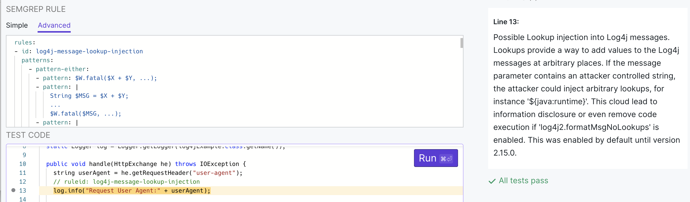
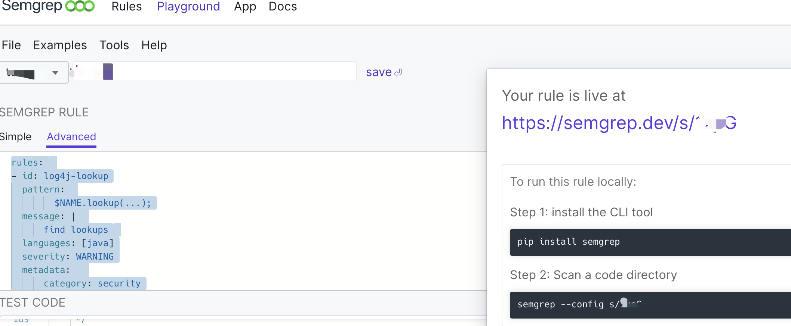
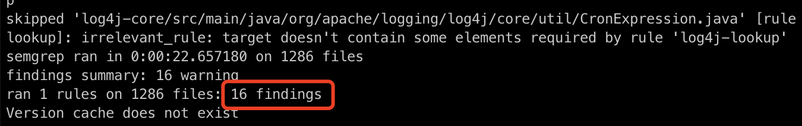
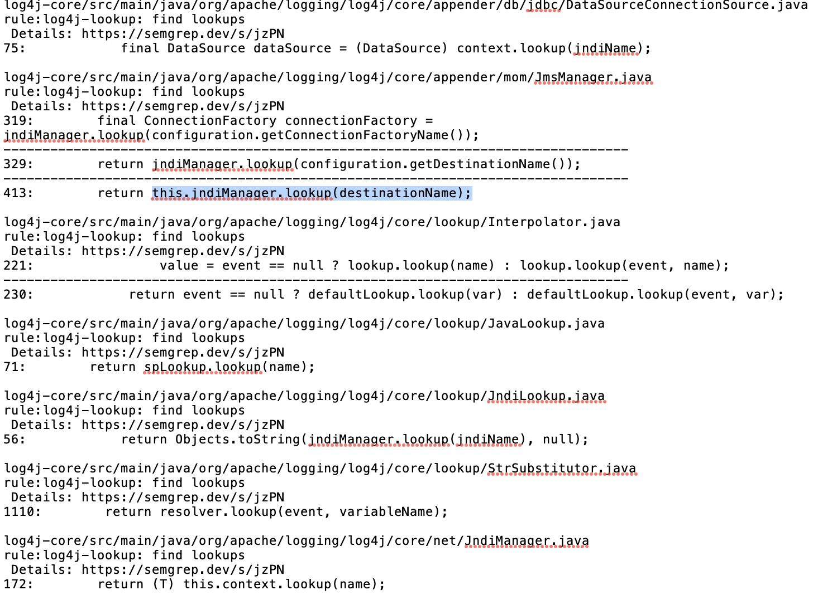
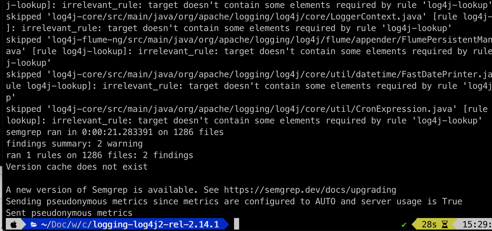
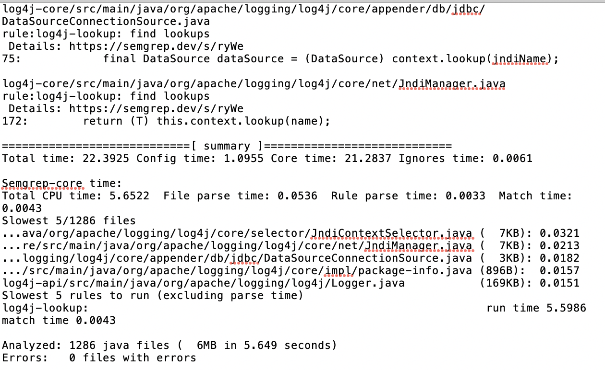

看到很多师傅都是使用codeql 来找log4j2 shell 的Sink和Source，例如FreeBuf 上的文章《[codeql分析log4j](https://www.freebuf.com/articles/web/318141.html) 》 、先知社区《[利用CodeQL分析并挖掘Log4j漏洞](https://xz.aliyun.com/t/10707)》 。但是好像没看到有人使用semgrep 来分析log4j的，因此就来尝试使用semgrep看看能否很容易地找到Sink和Source。

题外话：发现semgrep 网站上也有了专门针对[ log4j2 shell 漏洞检测规则 ](https://semgrep.dev/editor?registry=java.log4j.security.log4j-message-lookup-injection.log4j-message-lookup-injection)
这个规则可以用于前期应急的时候代码检测，但是后期就没办法知道哪些升级了哪些没升级，是否用的是安全版本了。


## 环境搭建
相比codeql 需要对log4j源码进行编译生成代码数据库的过程，semgrep 不需要对需要分析的代码进行编译的，因此直接把logging-log4j2-rel-2.14.1 这个版本的源码下载到本地即可，非常简单。

这里我使用semgrep  docker 方式部署来进行代码扫描的：
```bash
docker run --rm -v "${PWD}:/src" returntocorp/semgrep --config=s/xx  ./  -o scan-c.txt  --time --debug
```
关于semgrep 的更多详细使用方式可参考我之前的文章 [semgrep SAST编写自定义漏洞检测规则实践](https://www.freebuf.com/articles/web/286643.html)
## 编写规则
当然Sink 点还是落在JNDI注入的lookup方法上，所以首先初步匹配下lookup 方法，看看能匹配出多少个lookup。
只使用一个pattern，规则也是比较容易就写出来的:
```yaml
rules:
- id: log4j-lookup
  pattern:
        $NAME.lookup(...);
  message: |
      find lookups
  languages: [java]
  severity: WARNING
  metadata: 
      category: security
      technology:
        - java
      confidence: MEDIUM
```
在调试阶段，我们可以在[https://semgrep.dev/editor](https://semgrep.dev/editor) 上编写规则，验证好了之后可以通过share方式，然后通过--config=  去加载指定的规则。



从上图可以看到，找到了16处存在调用lookup方法的代码行位置:

### 优化规则

上一步的规则找到了16处的问题，但是一个一个去分析有点多，有必要进一步筛选下。知道JNDI注入会使用JNDI context方式，其中应该都会引入javax.naming.Context 或者 javax.naming.InitialContext 类，而且InitialContext 实现了Context 接口。
因此继续改造下规则，这次我们引入patterns 关键字来进行限定：
- (1) 要求调用lookup方法前导入了 <u>javax.naming.Context</u>
- (2) 要求调用lookup方法前导入了 <u>javax.naming.InitialContext</u>

基于上面的两种情况，编写如下规则：
```yaml
rules:
- id: log4j-lookup
  patterns:
    - pattern-either:
      - patterns:
              - pattern-inside: |
                  import javax.naming.Context;
                  ...
              - pattern: $NAME.lookup(...);
      - patterns:
              - pattern-inside: |
                  import javax.naming.InitialContext;
                       ...
              - pattern: $NAME.lookup(...);
          
    
  message: |
      find lookups
  languages: [java]
  severity: WARNING
  metadata: 
      category: security
      technology:
        - java
      confidence: MEDIUM
    
```
只需片刻时间，检测结果就出来了，这次看到只找到两处。


分别为 **DataSourceConnectionSource#createConnectionSource** 和 **JndiManager#lookup**。

通过上述规则找到了Sink点。
- JndiManager#lookup
```java
@SuppressWarnings("unchecked")
    public <T> T lookup(final String name) throws NamingException {
        return (T) this.context.lookup(name);
    }
```
- DataSourceConnectionSource#createConnectionSource
```java
@PluginFactory
    public static DataSourceConnectionSource createConnectionSource(@PluginAttribute("jndiName") final String jndiName) {
        if (Strings.isEmpty(jndiName)) {
            LOGGER.error("No JNDI name provided.");
            return null;
        }

        try {
            final InitialContext context = new InitialContext();
            final DataSource dataSource = (DataSource) context.lookup(jndiName);
            if (dataSource == null) {
                LOGGER.error("No data source found with JNDI name [" + jndiName + "].");
                return null;
            }

            return new DataSourceConnectionSource(jndiName, dataSource);
        } catch (final NamingException e) {
            LOGGER.error(e.getMessage(), e);
            return null;
        }
    }
```
## 关于查找Source 
首先，semgrep 对于数据流分析能力相较Codeql 来比是很弱的，因此想找到一条完整的调用链是非常困难。它最大的魅力在于已知Source和Sink或者sanitized的情况下，用于自动化检查开发是否按照编码规范进行编码的工具。
```yaml
rules:
- id: log4j-lookup
  patterns:
    - pattern-either:
      - patterns:
              - pattern-inside: |
                  import javax.naming.Context;
                  ...
              - pattern: $NAME.lookup(...);
      - patterns:
              - pattern-inside: |
                  import javax.naming.InitialContext;
                       ...
              - pattern: $NAME.lookup(...);
          
    
  message: |
      find lookups
  languages: [java]
  severity: WARNING
  metadata: 
      category: security
      technology:
        - java
      confidence: MEDIUM
    
```
只需片刻时间，检测结果就出来了，这次看到只找到两处。


分别为 **DataSourceConnectionSource#createConnectionSource** 和 **JndiManager#lookup**。

通过上述规则找到了Sink点。
- JndiManager#lookup
```java
@SuppressWarnings("unchecked")
    public <T> T lookup(final String name) throws NamingException {
        return (T) this.context.lookup(name);
    }
```
- DataSourceConnectionSource#createConnectionSource
```java
@PluginFactory
    public static DataSourceConnectionSource createConnectionSource(@PluginAttribute("jndiName") final String jndiName) {
        if (Strings.isEmpty(jndiName)) {
            LOGGER.error("No JNDI name provided.");
            return null;
        }

        try {
            final InitialContext context = new InitialContext();
            final DataSource dataSource = (DataSource) context.lookup(jndiName);
            if (dataSource == null) {
                LOGGER.error("No data source found with JNDI name [" + jndiName + "].");
                return null;
            }

            return new DataSourceConnectionSource(jndiName, dataSource);
        } catch (final NamingException e) {
            LOGGER.error(e.getMessage(), e);
            return null;
        }
    }
```
## 关于查找Source 
首先，semgrep 对于数据流分析能力相较Codeql 来比是很弱的，因此想找到一条完整的调用链是非常困难。它最大的魅力在于已知Source和Sink或者sanitized的情况下，用于自动化检查开发是否按照编码规范进行编码的工具。