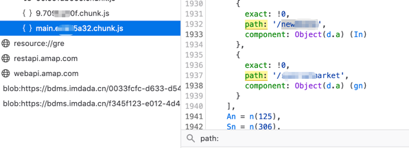

得益于Node.js 的快速发展和应用，越来越多的国内互联网企业为了提高开发测试迭代速度以及前端统一的需求，搭上了前后端分离的快车。从团队分工上，前端团队更希望专注于页面样式设计和用户交互，而不用受限于后端应用如何运行以及后端服务是否支持最新的前端框架等问题。基本上只需要约定接口，返回数据类型和格式就可以了。以Java 应用为例，从早期的JSP 到后期的Thymleaf/FreeMarker 等模版引擎，无一例外的是都需要后端服务跑起来才行，前后端团队间如何高效协同一直是一个不可避免的难题，相对而言，前端开发"话语权”就显得有些不足了，当然也仅代表个人看法。


# 前端打包工具—Webpack
简单理解，它就是一个打包器。由于目前主流的前端框架，例如VUE 是.vue 作为扩展名，而React 则是.jsx，但是这种格式浏览器不认识，所以webpack就起了很大作用，按照"万物皆可打包，一切皆是文件”的理念，webpack成了主流打包器之一。这样浏览器引擎只要动态解析并渲染页面就可以了。

### 如何一眼就看出是使用Webpack 打包的前端应用？
**方法1**：查看页面源代码，发现几乎全部引用的js ,且js的名字很长（注：一般是模块名称+模块内容的 Hash 值)，无论是在主页还是子页面/子菜单下基本都符合这个规律
```html
<!DOCTYPE html><html><head>
  <meta charset=utf-8><title>hello</title><link rel="shortcut icon" href=static/img/logo_white.svg><meta name=viewport content="width=device-width,initial-scale=1,minimum-scale=1,maximum-scale=1,user-scalable=no">
  <meta name=keywords content="hello">
  <meta name=description content="hello">
  <link href=./static/css/app.1ea46b30fa5ce7169ca4333a16db9c63V2.0.2_1610699496426.css rel=stylesheet></head><body style=overflow-y:scroll;>
    <div id=app></div><script type=text/javascript src=./static/js/manifest.774ee312c120e271e58dV2.0.2_1610699496426.js></script>
    <script type=text/javascript src=./static/js/vendor.13241be33831019166e6V2.0.2_1610699496426.js></script>
    <script type=text/javascript src=./static/js/app.1b9d4d540cea3c00d632V2.0.2_1610699496426.js></script></body></html>
```
**方法2**：F12 调试大法，看最下面是否有Webpack图标(火狐浏览器)。需要注意的是，有些前端应用即使Webpack打包的，但由于关闭了SourceMap，也同样不会显示:


 (图a productionSourceMap: true)


 (图b productionSourceMap: false)

 关闭SourceMap的代码示例：
 ```
  /**
      * Source Maps
      */
 ​
     productionSourceMap: false,
     // https://webpack.js.org/configuration/devtool/#production
     devtool: '#source-map',

```
**方法3**:人肉js ,查看js里面的内容开头是否有"webpackJsonp" 字样：


>延迟加载机制
webpack 关心性能和加载时间；例如：异步地加载 chunk 和预取。在打包过程中，模块会被合并成 chunk。 chunk 合并成 chunk 组，并形成一个通过模块互相连接的图。
chunk 有两种形式：
● initial(初始化) 是入口起点的 main chunk。此 chunk 包含为入口起点指定的所有模块及其依赖项。
● non-initial 是可以延迟加载的块

页面上直接表现为：有些前端应用不同的菜单会对应不同的chunk.js 。例如某系统默认用户只显示某几个菜单，加载了两个chunk.js ,但是当访问到除此之外的其它菜单后，又加载了新的chunk.js
对比如下：
https://a.testivy.cn/#/job
加载的js 结构如下：
-9.261acb1e.chunk.js
-main.24f96504.chunk.js
但是当访问 https://a.testivy.cn/#/widget
加载的js 结构如下，发现多了一个chunk.js ，因此这个菜单下的功能实现接口（增删改查）几乎全部都在59.c6f3e4e9.chunk.js 里面。
-59.c7f3e4e9.chunk.js
-9.261acb1e.chunk.js
-main.24f96504.chunk.js

有个疑问，怎么在/#/pro 这个页面知道其它菜单路由呢(例如/#/widget), 这个下面会结合案例具体分析。

因此，当遇到Webpack 站点时，如何高效进行测试成为了重点关注的问题。基于此，请求后端的接口就成为了突破点，绝大多数API都存在一些未授权访问漏洞，运气好的话还能遇到SQL注入等硬核漏洞，

下面我们讨论如何尽可能多的获取API。
# Webpack 主动API收集
  当使用主动方式进行API收集时，通过一系列正则表达式就能提取出大量的接口，推荐一个开源工具：Packer-Fuzzer，项目地址：https://github.com/rtcatc/Packer-Fuzzer ,可以进行一键进行API收集&渗透。


- 场景一、GET还是POST

    对API进行自动化测试，需要考虑这个接口的请求方法是否正确，如果后端只支持POST方式，GET请求可能会直接报错返回405状态码或者返回200状态码但是提示GET方法不支持，例如{"errorCode":"1025","errorMsg":"请求方法不允许"}
Packer-Fuzzer 是根据状态码405 和SpringBoot 的一些特征做鉴别的，实际上笔者实践下来，其实对于POST方式自动化渗透是有很大难度的，一方面场景复杂，还有就是POST 方法的报文体很难自动构造，不同业务差别很大。
- 场景二、query

    相对而言，GET请求的API参数发现容易，query一般为?xxid= ，而/xxlist 一般不需要加参数，直接跑一遍接口即可，若能检出问题的话一般都是垂直越权问题。同时也发现个别企业应用具备通用规范，这个需要根据不同行业和企业进行定制化，后面会从接口自动化发现、Get和Post 请求方法自动切换 、请求参数自动补全和数据项填充 三个方面进行分析，总结《API-Service自动化渗透测试实践》（酝酿中）。
- 场景三、提取规则

    尽可能根据Webpack打包后的代码的一些特征来编写规则。例如原工程中使用axios 进行get 请求获取数据的代码片段如下所示：

    ```
 axios.get("/api/config").then(res=>{
            return res.data
        })
        ```

经过Webpack 打包后可能就会变成下面的代码

```
   r.a.get('/api/config').then(function (e) {
        e.data
      })
```

基于此可以.get(" 或.post(" 等进行提取，各种可能情况可以参考Packer-Fuzzer 的 Apicollect.py 代码，几乎能匹配到大多数接口了，可以参考他们的文章-https://mp.weixin.qq.com/s/0YDXUbJuKue01H9w35xf-A。

```
 self.regxs = [r'\w\.get\(\"(.*?)\"\,',                    
                      r'\w\.post\(\"(.*?)\"\,',
                      r'\w\.post\(\"(.*?)\"',                   
                      r'\w\.get\(\"(.*?)\"',                    
                      r'return\s.*?\[\".\"\]\.post\(\"(.*?)\"',
                      r'return\s.*?\[\".\"\]\.get\(\"(.*?)\"'              ]
```

# Webpack 被动API收集
 虽然主动式API收集更方便，但实践下来发现主动方式仍存在一定的局限性。一方面是前面说的延迟加载问题，当然Packer-Fuzzer针对这种场景做了一些尝试，但有些网站没有manifest或是app开头的js文件，但的确是异步加载的；另一方面，是主动检测效果并不好，因为请求参数自动补全和数据项填充方面通过fuzz的方式效果并不理想，有时候靠运气，一般对于大型网站而言这种方式非常困难。
 在测试过程中就遇到以下场景：当访问https://ab.testivy.com/index ，返回如下代码
 ```
//省略
o=document.createElement("script");
o.src=function(e){return a.p+"static/js/"+({}[e]||e)+"."+{0:"60f8d448",1:"199d65ff"}[e]+".chunk.js"}
<script src="https://js.testivy.com/static/js/main.e0976a32.chunk.js" crossorigin="anonymous"></script></body></html>
```
这种情况下Packer-Fuzzer 就几乎失效了，所以需要进一步优化，后面todo并反馈给开发者。下图为Packer-Fuzzer 匹配结果，发现输出了空的jsCodeList。

为了更好的知道接口的请求参数构造最大可能发现接口存在的安全漏洞，可以进一步优化。这种情况下，首先人工来分析下看，后面找出规律后再进行自动化。对于main chunk 来说，基本都会有path: 或 pathname: 。



这个定义了页面的路由。简单来说，就是https://ab.testivy.com/index/#/new 这个会跳到一个新的菜单页面，而这个时候就会加载新的chunk.js。同样地，
访问https://ab.testivy.com/index/#/market 也会进入新的页面并加载对应的chunk.js。

新页面下，一些可见的功能就会调用对应的接口，可以通过xray进行被动扫描，效果会更好。


当然了，如果遇到无账号登录并强跳转下如何进行绕过并进行接口发现，我们下期再谈。

# 参考
- https://webpack.docschina.org/concepts/manifest/#manifest
- https://mp.weixin.qq.com/s/0YDXUbJuKue01H9w35xf-A?st=0548219E49057D17E8A9601A8C078C850727D498A4F42AB010B4F4C1654ACC60F3AEAE4081B6C93873C5F855C35085AC77481C1751551AC90054372FE70765C5A9851606A70A0C906AE4BCBDE100CD564D2917B55649C8D545B9C7DCD992ABEA69CE43B0F614D5080552F300524C4740FF899AD65B83C98DA8DAF8B6CE36D39BD7ACF15DC1277C7EE3B3B1666B730A07&vid=1688850329036896&cst=95F420C11CCA6987A38D8D8410A2C326DD6AEF7A43E1ED6B664B7903D6269DE1D0D05B1AE8E6007EA9A6978CA0D997C9&deviceid=bace690d-cdda-429c-a97a-69caa0b89fb4&version=3.1.0.2353&platform=mac
