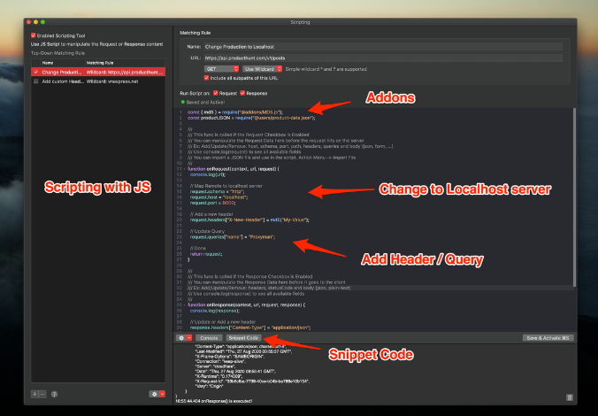
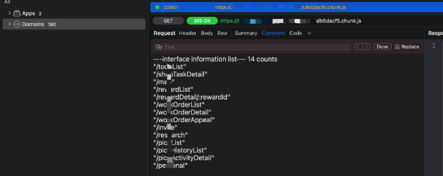
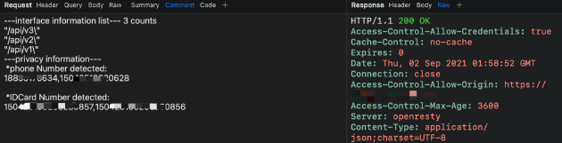

# 题外话
题外话
《中华人民共和国数据安全法》已于今年9月1号正式实行，企业在数据的采集、传输、存储、使用和销毁等环节变得更加重视。众多企业下一步的重点工作将是数据的分类分级和数据生命周期管理，尤其和“个保法”紧密关切的个人敏感信息内容。在渗透测试过程中，加强敏感数据“脱敏”鉴别已然成为了我们工作的重点，敏感数据种类那么多，而全人工介入工作量巨大，能否实现半自动化来减轻工作量呢？
# Proxyman的Scripting 简单介绍
Proxyman Scripting 提供了通过JS自定义编写脚本的功能，开发人员可以灵活的操作请求/响应。之前笔者使用它编写了RSA加解密的库，见《Proxyman 从0开始编写RSA Addons》。
Scripting 特点：
1.通过JS代码实现Map Local / Map Remote / Breakpoint

2.更改请求内容，包括Domain、Host、Scheme、Port、Path、HTTP Method、HTTP Headers、Query、Body（Encoded-Form、JSON、纯文本）

3.更改响应内容，包括 HTTP 状态代码、HTTP 标头、正文（JSON、编码格式、纯文本、二进制...）

4.为常见任务提供大量内置插件和库，例如散列、编码/解码、JSON-文本转换器、美化...

5.能够编写自己的 JS 插件或库

6.旨在取代 Charles Proxy 的重写 GUI 工具

7.使用 ShareState 或环境变量在每个脚本或当前会话之间分配和接收共享状态

（以上图片来自:https://docs.proxyman.io/scripting/script)

# 检测脚本介绍
之前使用了一款BurpSuite 的插件—Unexpected_information(https://github.com/ScriptKid-Beta/Unexpected_information），能够提取一些有用的信息，也挺好用。但是笔者觉得Proxyman 的搜索功能强大，用的比较顺手，但还想用Burp的这款插件，因此都是把Proxyman 的流量再代理到Burp上，浏览器上没啥大问题，但是遇到一些移动APP的流量在Proxyman到Burp的时候总是因为各种证书的问题导致Burp 无法建立https链接，索性自己用Proxyman Scripting 实现类似的功能。
关注的点：
## 信息提取步骤： 
一、编写规则

笔者所在公司前端应用都是用Webpack 打包的，因此接口提取和收集自然水到渠成，提取规则也很容易编写出来。 其它信息—例如手机号、邮箱等提取方式一样。
let path_reg = /("|')(\/[0-9a-zA-Z.]).*?("|')|(["|'](\/v[1-9].*?)")|(["|'](\/api.*?)")/g;
这里提取了双引号或者单引号包裹的 /开头的字母数字，例如"/path/xx"，同时也考虑了一些开发经常写的接口——"v1/path/xx" 和诸如"/api/path/xx"
提取到这些接口后，可以写入到文件中进行后续自动化扫描，也可以加颜色显示或者将接口信息写入到Comment 中（备注：Proxyman没有像Burpsuite那样增加tab的功能，但是我们可以使用Comment 功能，将感兴趣的内容写入到Comment中，也算是一种办法吧）

二、接口去重

由于接口提取后会存在重复的接口，最好能够去重后再展示，可以使用Set进行去重。
var interface_no_duplicate = [...new Set(interface)];

三、突出展示/写文件

通过  response.color = "yellow"; 将匹配到的请求标记为黄色，目前Proxyman 支持red, blue, yellow, purple, gray, green 共6种颜色。
也可以将提取的内容写到文件里
writeToFile(interface_no_duplicate.toString().replaceAll(",", "\r\n"), "~/Desktop/sample/" + host_from_referer[2] + context.flow.id + ".txt");

四、效果展示
使用Comment 将接口列表展示出来

# 整体效果

