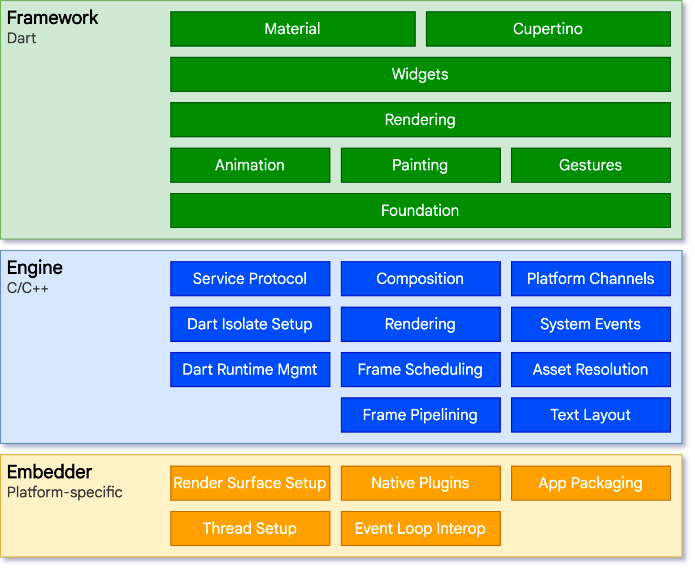
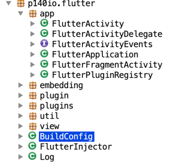
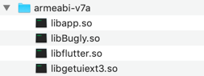
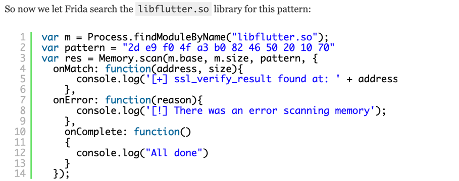
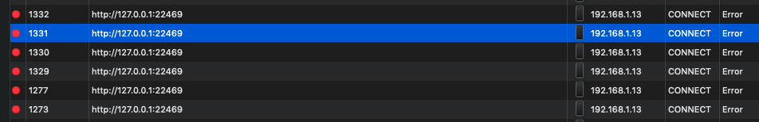
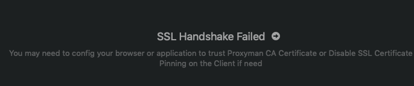
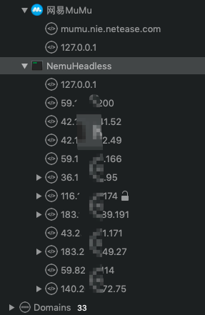
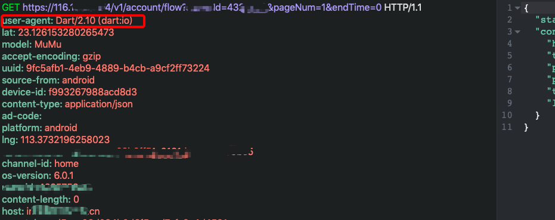

最近需要给公司的一款APP做渗透测试，通过WIFI代理后发现根本没有任何流量导入，APP上界面也没任何报错且功能也不受影响，这就很奇怪。后面才发现原来这个APP是基于Flutter框架开发的，万事开头难，那就先研究下何为Flutter吧。

# 0x01 Flutter基本介绍
Flutter是Google开发的一套全新的跨平台、开源UI框架，帮助开发者通过一套代码库高效构建多平台精美应用，支持移动（iOS、Android系统）、Web、桌面和嵌入式平台。
## Flutter 架构

<center>以上图片来自Flutter 官网</center>

Flutter的核心是Flutter引擎，它主要是用C ++编写的。它提供Flutter核心API的最小实现，包括图形绘制（通过Skia），文本布局，文件和网络I/O，Dart运行时和编译工具链等。

## Dart 语言
Dart 语言
Dart是一种强类型、跨平台的客户端开发语言。具有专门为客户端优化、高生产力、快速高效、可移植（兼容ARM/x86），由Google负责开发和维护，在2011年10月启动项目，2017年9月发布第一个2.0-dev版本。
> Dart本身提供了三种运行方式：
> 1. 使用Dart2js编译成JavaScript代码，运行在常规浏览器中（Dart Web）。
> 2. 使用DartVM直接在命令行中运行Dart代码（DartVM）。
> 3. AOT方式编译成机器码，例如Flutter App框架（Flutter）。

# Flutter 运行机制
当发现lib 目录下存在 libflutter.so，毫无疑问这个APP是使用Flutter 框架开发的。由于Flutter APP不会走系统代理，必须要在程序中显式地指定代理服务器地址。类似这种会让APP走localhost:8888代理：
```Dart
(dio.httpClientAdapter as DefaultHttpClientAdapter).onHttpClientCreate =
      (HttpClient client) {
    client.findProxy = (uri) {
      //proxy all request to localhost:8888
      return "PROXY localhost:8888";
    };
    client.badCertificateCallback =
        (X509Certificate cert, String host, int port) => true;
  };
```
或使用 Dart HTTPClient 显示指定 ：
```
HttpClient httpClient = new HttpClient();

// the client's proxy.
httpClient.findProxy = (uri) {
  return "PROXY localhost:8888";
};

httpClient.badCertificateCallback = 
  ((X509Certificate cert, String host, int port) => true);
```

目前遇到的问题是Flutter 打包好的APP天然就已经加固了，反编译然后添加上述代码存在一定技术难度。比如我们可以看到反编译之后的代码结构：com.test.app 
它只有微信的支付的两个Activity，通过AndroidManifest.xml 知道入口在p140io.flutter.embedding.android.FlutterActivity，当应用启动后，它会加载libflutter.so ，之后任何渲染、输入或事件处理等都会 delegate 给APP。



lib 目录下可以找到libflutter.so


搜索网上的资源，发现针对Flutter APP  https抓包的实践甚少，大部分是翻译的这篇文章：[Intercepting traffic from Android Flutter applications](https://blog.nviso.eu/2019/08/13/intercepting-traffic-from-android-flutter-applications/)
也就是通过使用frida 来hook libflutter.so 里面BoringSSL 证书校验部分逻辑。

> 

那么回到这个问题本身上，如果不用Frida hook 就真的没办法抓包了吗？经过不断尝试，我发现了一种捕获https流量的新办法。
# Flutter 抓包新方法
目前，针对Flutter APP抓包除了使用frida hook 外，想到能不能换一种更简便的方式。因此使用了网易的MuMu 模拟器+Proxyman（当然也可以用Burpsuite) 做了一些尝试最后成功抓到https流量，步骤如下：

- ### 使用proxychains 将Memu模拟器流量强制走Proxyman(Burpsuite) 代理

proxychains.conf 如下:
```
[ProxyList]
# add proxy here ...
# meanwile
# defaults set to "tor"
#socks4         127.0.0.1 8888
#socks5    127.0.0.1 1089
http   127.0.0.1  8888
```
启动
```
proxychains4  open -a /Applications/NemuPlayer.app
[proxychains] config file found: /usr/local/etc/proxychains.conf
[proxychains] preloading /usr/local/Cellar/proxychains-ng/4.14/lib/libproxychains4.dylib
[proxychains] DLL init: proxychains-ng 4.14
```
之后发现模拟器界面冻结，所有按钮点击失效，网络恢复功能也无效，最后查找原因是因为模拟器本地交互的流量因为启用了"HTTPS Response" ,所以要把IP为127.0.0.1 的https 拦截模式取消。


- ### 将Proxyman/Burpsuite 的CA证书导入的安卓模拟器的系统信任证书里

上个问题解决之后，当打开测试的flutter APP 后还是不行，Proxyman 报了一个“SSL Handshake Failed" 的错误，说明之前导入到模拟器的Proxyman CA证书不受信任。想到flutter app 是不信任用户证书的，只信任系统证书，所以下一步把Proxyman的CA证书导入的安卓模拟器的系统证书里面（具体步骤百度即可，不再赘述)。



- ### 若需要修改报文里面的参数或者重放报文时，需要把请求中的IP地址替换为相应的域名

  如果遇到 这个报错信息:
``` The certificate for this server is invalid. You might be connecting to a server that is pretending to be “116.xx.x.174” which could put your confidential information at risk. (code=-1202)```

 最后重启模拟器，发现流量都进入到Proxyman 里面了，但都是IP 显示的，后续需要定位哪个是测试APP的流量。

- 

如果不知道这个APP请求的后端服务域名，尽量只装这一个APP，其它无关的应用都卸载，多次点击功能，找到NemuHeadless 应用栏里面最新的URL，然后比较IP匹配的域名即可。
还可以编写脚本将Header 里的host提取出来自动替换请求参数中的IP地址部分。



最后可以拦截到这个Flutter APP的https流量，之后就可以按照正常测试流程来了。

以上内容如有错误之处，还请大家不吝指出。

# 参考文章
- [官网](https://flutter.dev)
- [Flutter Web 在美团外卖的实践](https://mp.weixin.qq.com/s/cJjKZCqc8UuzvEtxK1BJCw)
