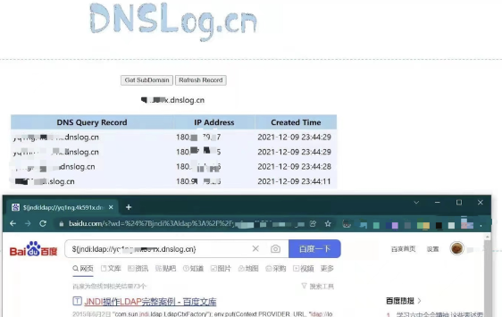

本文通过回忆今年爆发的“核弹级漏洞”—log4j2 RCE 漏洞应急过程，评价当时应急方法和策略的优缺点，并与大家探讨如何推动甲方在组件安全治理能力建设上更进一步。

# 暴风雨要来了

2021年12.9号晚和往常一样准备睡前刷刷抖音了。晚上10点多的时候看到各种群里发的log4j  DNSLog的截图，当时第一眼看到这个截图都惊呆了，某度都在受影响范围内。好多都在说“这个漏洞好严重”，“赶紧修”，“出来应急啦”，“很严重但是不知道怎么用”之类，一晚上都没怎么睡好觉，准备明天上班的时候赶紧通知研发处理下（半夜没敢打扰开发，但后来听说有的公司凌晨就已经打电话把开发叫起来去修漏洞了～）。

# 怎么决策

12.10号这天各种新闻就漫天出来了，很多文章标题都是用的“核弹级漏洞”、“史诗级漏洞”，连老板都从XX头条上知道了这个漏洞。安全人员首先要做的第一个决策就来了，是采取缓解措施还是升级？
参考各安全通告，缓解措施是：
（来自某安全公司）

<bold> 1、紧急缓解措施：</bold>

- （1） 修改jvm参数 -Dlog4j2.formatMsgNoLookups=true     
- （2） 修改配置log4j2.formatMsgNoLookups=True
- （3） 将系统环境变量 FORMAT_MESSAGES_PATTERN_DISABLE_LOOKUPS 设置为 true

先不说这3种措施哪个有效，单拿出第2条中的“修改配置”是指哪个配置？是log4j2.properties里面增加一条，还是新建啥配置文件，反正是很模糊和懵逼的。因此当时直接就把这个pass掉了（后续看到在漂亮鼠师傅的 [甲方需谨慎对待log4shell漏洞的修复](http://mp.weixin.qq.com/s?__biz=MzIxNDAyNjQwNg==&mid=2456098698&idx=1&sn=8c66b476cb303bdf413337bc5c92e127&chksm=803c6643b74bef55d1606a424e555ef09e27b8736928acdca027332453c6d9e4d7a11d7e589d#rd)
文章里分析和指正了：
> 1. 这三个在2.10以下均处于失效状态，如果你第一时间推送了这三个那么你要注意点
> 2. 系统环境变量这个key值是错误的

<bold> 2、升级方案：</bold>

log4j 2.x <= 2.14.1 升级到 2.15.0 （后来又再传 2.15.0-rc1 被绕过了需要升级到2.15.0-rc2 ）

同时我所在的安全团队根据目前公司实际情况也进行了决策，一下几个步骤现在看起来可能有不恰当的地方，但当时情况还是有点分身乏力的：

- （1）尽快拉出受影响的应用服务清单让领导知悉

   由于公司已经有统一发布平台，经过该平台上线应用组件依赖都已经存到数据库里，通过平台直接拉出受影响的应用服务清单，包括服务名，开发owner，log4j的版本信息，这样安全同学能够快速定位到有多少应用受到影响，做到心中有数。同时也便于尽快将数据汇报给领导。有的公司安装了HIDS之类的也能梳理出个大概，但是难在覆盖率的问题（这个会有成本，一般互联网公司不会全部覆盖）以及数据聚合/分析的成本。

- （2）升级/缓解，缓解措施用第一条
  
   如果采取缓解措施，一般都会让运维对受影响的应用服务统一设置jvm 参数重启应用，安全进行验收，最后将升级好的应用数据汇总形成报告反馈。
- （3）由于使用了WAF，定时跟进厂商WAF策略情况

   虽然会存在被绕过可能，然而能够阻挡大部分攻击已经不错了。同时这部分工作量在云厂商那里，他们可以不断迭代防御策略，并且由于是默认生效的，我们不需要再进行单独启用拦截规则，只需要定时去跟进下即可。

- （4） 跟进外采系统、供应商系统，推动对方尽快升级
   
   对采购的系统也要覆盖到，因为这些系统最容易被忽略。需要盯紧对方尽快完成升级。

- （5）安全部门提供检查工具，开发可以自助进行检测
 
   有些公司已经有一些安全检查工具，如果能够让开发在本地或者流水线里进行检测，这部分包括一些开源的中间件产品、大数据类系统以及极少量没有通过devops平台发布的应用等（比如一些不走统一发布平台的系统），例如kibana、Flink等。由于大部分都是内网使用，开发可以自助检测后排期修复。

- （6）使用扫描器，无论是自研的还是采购的（采购的需要跟进下对方扫描策略是否已经可以正式使用），先把外网的资产跑一遍，看看还有哪些遗漏的。
- 这部分可能在第一天应急的时候没有时间来做，但可以放在后面来做。

# 一些分歧
- 为什么敢重启应用而不是通过删除JndiLookup.class 文件，这样不更彻底了吗防止升级再绕过？
      
    从安全角度来说，无论是升级重启应用还是删除文件最终都是让风险得到缓解。但是有几点个人觉得不是技术上的问题而是公司文化上的差异。

    > 第一点：删除文件这个事关系到安全同学是否有能力分析删除后业务不出现问题，以及能否给业务足够的信心，其实更多地是业务需要安全部门能够承担风险。

    > 第二点：就是容易说不清楚，这一点我想大家应该体会到，即使你装了RASP，后续业务出现的一切问题开发是不是来问是不是安全这边装的RASP导致的？你这删除了线上包的文件，开发难免会有一些质疑。

    > 第三点：不同公司的应用架构不一样，比如有的公司是微服务、无状态的、弹性扩容架构的，你删除了这个机器的JndiLokkup.class文件，后续机器自动扩容了怎么办，除非再弄一个脚本，那不就和增加启动变量一样了甚至还不如增加jvm启动参数呢。

- 应用重启代价大，业务容易受到兼容性影响？
    
     这一点很多安全同学和开发同学都会关注到，贸然升级到高版本可能会导致应用出现兼容性问题，引发业务故障。为了修一个漏洞导致业务不可用了，是否代价有点高？但是这个问题个人看法是因不同公司的技术能力而定，比如有的公司是有灰度发布和全链路观测的，对应用日志和告警做的比较好的话，其实很容易发现问题及时停流量或者切换链路，而且也肯定是要在测试环境先进行验证的，这部分工作应该由专业度更高的架构同学来参与分析和验证，不是说安全要扛起来整个担子，也切记这样做，毕竟安全是整个公司人人都要参与的。更甚者说，安全同学毕竟不是在开发一线，对应用兼容性和故障理解难免要逊于开发，尤其是资深的架构师。

- 运行时加载agent，拦截JndiLookup类

    万不得已不建议这样做，虽然好处是不用重启应用。为什么不建议这样做，因为我们是在应急，短期写出来的代码是否充分做过测试还未得知。即使这个程序是某位安全公司大牛写出来的，但是能够确保通用吗？每家公司的应用和场景是很复杂的，如果一切ok，开发会说我们公司的安全真牛逼。但是一旦出现了问题，期望越高失望就越大。这个时候如果甲方里的安全工程师说我得去问问某某公司安全实验室，代码是他们写的，我们只是拿来用的话，这个时候你猜开发会怎么想。

# 出现漏洞雪崩
再后来从2.15.0之后相继出现拒绝服务漏洞(CVE-2021-45046)后来又升级成RCE漏洞，新的拒绝服务漏洞（CVE-2021-45105），最后还有一个非常搞笑的是Log4j配置文件可修改的情况下JNDI导致的RCE漏洞（CVE-2021-44832），叕已经到2.17.1版本了。详细可在https://logging.apache.org/log4j/2.x/security.html 查找。
除了几家安全厂商不断更新发通告外，似乎没有了以前的热度。究根到底是后续漏洞都不是默认配置可以触发的。这一次我们没有通知给开发再次升级，除了因为代码仓库里没有搜索到可触发上述漏洞非默认的配置/代码片段，还有就是有些利用条件太苛刻了，有时候也要看安全投入产出比的。

# 怎样做组件安全治理
经过此次log4j漏洞风波，应该是检验了不少企业的安全应急能力了。很多公司的组件安全治理之路还有很长的路需要走，而下一个类似Log4j shell 漏洞会不会出现就不得而知了。那组件治理通常有哪几部分组成了？
> 1.制品库源准入控制
> - 安全人员负责审核制品入库标准，由质量团队负责制品的动态调整，比如开发同学需要新的组件了，安全审核此组件是否有历史高危漏洞，评审通过后加入到内部仓库中，开发才能通过后续的构建，否则构建失败，开发被动去调整组件版本以达到上线标准
> - 优点是开发引入包的过程中只能引入到安全的版本，否则本地都编译不过；但是需要安全有足够话语权，业务容易拖垮安全人员，安全审核量巨大，用户体验不好，开发容易出现情绪等等。

> 2.构建过程制品准入控制
> - 和制品库源准入控制不同之处在于不关心开发引入的什么组件，什么版本，但是只要命中我安全定的组件黑名单就不能通过构建。一般公司都是将组件安全检查加入到流水线中，开发只需要不断修改直到达到上线标准即可。

> 3.建立组件CMDB
> - 如果新爆发出某某组件有重大安全漏洞，前面两个控制都会面临难题，因为不可能让所有应用重新发布一次，那么这个时候通常面临无数据可循的麻烦。一方面不能挨个问开发用没用XX漏洞组件，这样不仅会造成遗漏还会导致沟通成本过高，无法起到应急的关键作用。因此通常还会在构建过程中将所有应用引入的组件落库，包括组件名称、坐标、版本等信息，这样安全人员只需要检索下就能掌握所有关键信息

> 4.多管齐下，提高覆盖率
> - 在实际实践中发现，企业内部并不是全部系统都会走统一发布平台，比如供应商的系统等等，这个时候也就需要一些粘合剂，比如建立供应商信息上报制度，或者在主机侧安装一些agent 将数据做扎口，安全尽量掌握所有组件资产信息，让数据多跑路。

以上内容如有错误之处，还请大家不吝指出。

