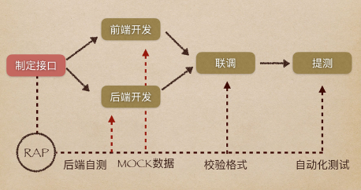
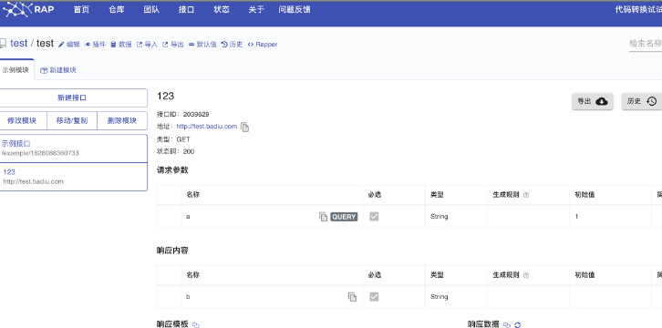
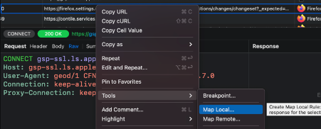
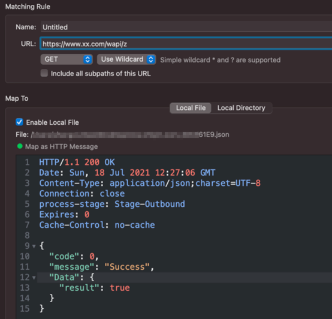
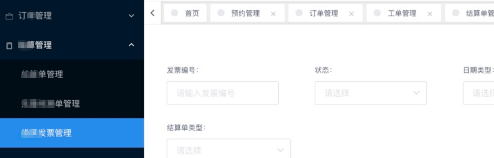
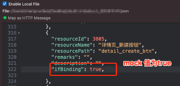
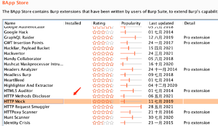
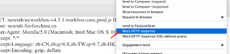
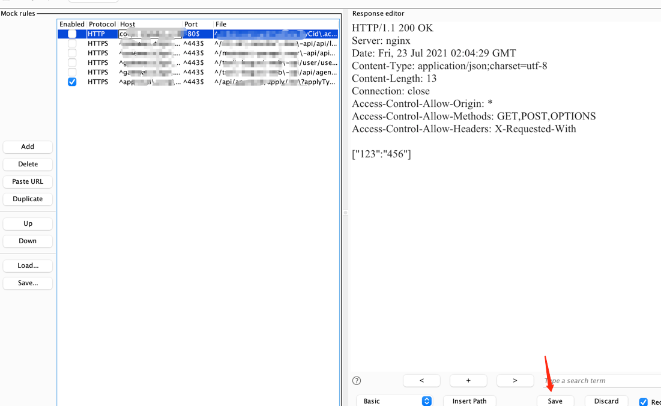

Mock 这个词在软件测试行业较为常用。Mock 方法是单元测试中常见的一种技术,
它的主要作用是模拟一些在应用中不容易构造或者比较复杂的对象,例如模拟某个接口在某些情况下的返回值。亦或者前端测试团队更期望专注于快速检验数据返回和展示是否满足期望值，在后端还未完全实现后端接口功能时即可通过模拟接口的响应内容来进行测试
例如阿里妈妈前端团队出品的RAP就是一款出色的接口文档管理和MOCK平台。
> RAP通过GUI工具帮助WEB工程师更高效的管理接口文档，同时通过分析接口结构自动生成Mock数据、校验真实接口的正确性，使接口文档成为开发流程中的强依赖。有了结构化的API数据，RAP可以做的更多，而我们可以避免更多重复劳动。

# 需要 Mock的场景
在渗透测试过程中，经常会遇到权限控制，无法访问到某个角色下的功能菜单。
因此本文会从两个角度来说明MOCK是如何起作用的，并一起讨论如何通过MOCK挖掘到更多的漏洞。首先要说明一下为什么渗透测试中也需要MOCK，一方面是为了绕过前端的限制，例如前端的timeout设置，抓包改包手动来不及，另一方面是为了方便接口“造数据”——也就是有些接口的一些参数规则手动构造麻烦，在MOCK了前一个请求返回值后，下一个请求才会自动拼接好参数请求，这样就省去了自己看js 代码构造的麻烦。
俗话说“工欲善其事，必先利其器”，一起看看有哪些工具可以辅助。
# Mock 工具

笔者分别在Proxyman和Burpsuite 这两款抓包工具使用了MOCK功能/插件。在Proxyman 中，它是在Tools-Map Local （本地）和Tools-Map Remote (远程）。以Map Local 为例，我们可以选中感兴趣的接口右键添加到Map Local/Remote

然后编辑期望的返回类型和返回值，同时可以设置匹配的路径，匹配的请求方法等。

上面演示了某系统前端根据result 的value 是否为true 来判断是否可进入到登录后的index页面，否则会提示用户名和密码错误。如果通过手动改包的话，会提示超时或者请求错误，前端无法跳转到登录后的页面。这个时候就可以通过MOCK将result的值修改为true ，这样就进入到系统从而进一步进行渗透，挖掘功能模块是否存在未授权访问等漏洞了。

还有些系统的权限资源是根据接口返回的资源路径来做展示的，例如会请求https://testivy.local/resource/list，根据返回报文中的ifBinding来确定当前登录用户是否具有该对应菜单的权限，因此就可以MOCK这个ifBinding 全为true 就可以了访问所有功能菜单了。

在BurpSuite中同样也有MOCK插件，在插件市场安装HTTP MOCK

同样在HTTP history 右键选中Mock  HTTP response

然后编写期望的MOCK值，最后要点击save 生效。（确认Enabled 那栏是否选中）

最后当在浏览器访问的网站匹配到这个接口时，会自动替换掉返回内容。但是在HTTP history 找不到这条历史记录，这个就和Proxyman 不太一样了，Proxyman是可以看到在Edited那栏中看到编辑的图标的，代表这个请求已经被修改过

下面举个几个典型场景中使用Mock方法。

# 可注册的低权限账号/商家审核中的账号

以上内容如有错误之处，还请大家不吝指出。

