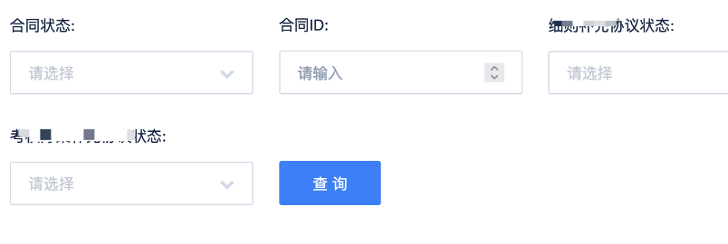

Mock 这个词在软件测试行业较为常用。Mock方法是单元测试中常见的一种技术,
它的主要作用是模拟一些在应用中不容易构造或者比较复杂的对象,例如模拟某个接口在某些情况下的返回值。亦或者前/后端测试团队更期望专注于快速检验数据返回和展示是否满足期望值以及自动化测试等。目前有很多开源或者商业Mock平台，例如阿里妈妈前端团队出品的RAP就是一款出色的接口文档管理和MOCK平台。

> RAP通过GUI工具帮助WEB工程师更高效的管理接口文档，同时通过分析接口结构自动生成Mock数据、校验真实接口的正确性，使接口文档成为开发流程中的强依赖。有了结构化的API数据，RAP可以做的更多，而我们可以避免更多重复劳动。

# 需要 Mock的场景
在渗透测试过程中，经常会遇到权限控制，无法访问到某个角色下的功能菜单。
因此本文会从两个角度来说明MOCK是如何起作用的，并一起讨论如何通过MOCK挖掘到更多的漏洞。首先要说明一下为什么渗透测试中也需要MOCK，一方面是为了绕过前端的限制，例如前端的timeout设置，抓包改包手动来不及，另一方面是为了方便接口“造数据”——也就是有些接口的一些参数规则手动构造麻烦，在MOCK了前一个请求返回值后，下一个请求才会自动拼接好参数请求，这样就省去了自己看js 代码构造的麻烦。
俗话说“工欲善其事，必先利其器”，那就看看有哪些工具可以辅助测试。
# Mock 工具

笔者分别在Proxyman和Burpsuite 这两款抓包工具使用了MOCK功能/插件。在Proxyman 中，它是在Tools-Map Local （本地）和Tools-Map Remote (远程）。以Map Local 为例，我们可以选中感兴趣的接口右键添加到Map Local/Remote

然后编辑期望的返回类型和返回值，同时可以设置匹配的路径，匹配的请求方法等。

上面演示了某系统前端根据result 的value 是否为true 来判断是否可进入到登录后的index页面，否则会提示用户名和密码错误。如果通过手动改包的话，会提示超时或者请求错误，前端无法跳转到登录后的页面。这个时候就可以通过MOCK将result的值修改为true ，这样就进入到系统从而进一步进行渗透，挖掘功能模块是否存在未授权访问等漏洞了。

还有些系统的权限资源是根据接口返回的资源路径来做展示的，例如会请求https://testivy.local/resource/list，根据返回报文中的ifBinding来确定当前登录用户是否具有该对应菜单的权限，因此就可以MOCK这个ifBinding 全为true 就可以了访问所有功能菜单了。

在BurpSuite中同样也有MOCK插件，在插件市场安装HTTP MOCK

同样在HTTP history 右键选中Mock  HTTP response

然后编写期望的MOCK值，最后要点击save 生效。（确认Enabled 那栏是否选中）

最后当在浏览器访问的网站匹配到这个接口时，会自动替换掉返回内容。但是在HTTP history 找不到这条历史记录，这个就和Proxyman 不太一样了，Proxyman是可以看到在Edited那栏中看到编辑的图标的，代表这个请求已经被修改过。

下面举个例子。

# 可注册的低权限账号/商家账号

在测试过程中，当核心系统或者面向C端用户的系统被撸了个遍的时候，通常是很难找到漏洞的，即使能找到也多是一些重复的或者内部已知的。因此柿子就要找软的捏，哪种柿子好捏，一种是面向商家的系统，但这种系统的特点也很明显，要么就是可以注册但是必须提交各类证件，例如法人身份证，营业执照等后台人员审核通过后才能使用商家系统的功能；要么就是商务合作之后分配的账号，没有注册入口。首先我们来说可以注册但需要审核的商家账号吧。

首先来看下提交资质文件审核的流程：

通常这类商家资质材料需要营业执照、法人身份证、法人姓名、门头照、开户行等，能够正确准备这些材料并且顺利通过审核还是难的。尤其对于我们想快速测试下接口漏洞来说，时间就是金钱。因此通过MOCK 可以快速测试审核通过后有哪些功能模块以及相应接口是否存在可挖掘的漏洞。

比如某系统需要提交一些资质信息进行审核，审核通过才具有商家功能。

 (图片中的数据为示例数据)

由于这个系统是人工进行审核的，而且提交过几次都是被打回来了，审核不通过，这个时候想到用MOCK下。
首先打开首页的时候是有一个接口请求当前商家状态的，是未提交、审核中还是审核通过状态。
发现查询审核状态接口：/**/company/detail/v2
这个时候可以把这个接口进行MOCK，在proxyman 中对应的是Map。将状态改成6（审核中是1，待审核是0），说下这里为啥找到“审核通过”的状态码是6—可以通过js （在js 搜“待审核”，找到对应的代码行位置，然后就能轻松找到“已审核”对应的状态码了）

 (图片中的数据为示例数据)

由于商家通过审核，前端一般会展示出对应的功能，如果后续还有新的接口校验商家状态的，也一样进行MOCK。这样就方便了针对接口的参数构造，省去了一行行看代码的烦恼，而你只需要做的就是点点，获取完整请求参数后再进行工具扫描。
通过上面的MOCK过程，就可以顺利进入到合同页面：

接下来，我们可以找到对应模块的功能点开始“大刀阔斧”了。这里可能很多人会有疑问，有很多工具可以从js 提取接口，这样多麻烦。这在前面的文章《现代前后端分离式应用API渗透测试探究》已经讨论过。
# 无法注册的后台账号/内部员工账号
针对这类系统，由于没有注册入口，通常都是管理员或者内部员工才能登录。这里MOCK难度在于寻找或者猜测正确参数。一些简单的系统根据Response 中的resultCode 是true 还是false 决定是否跳转到后台页面，但有些是返回的是大串的字符串，这个时候就要看一看js了（也可以在html或者js中搜-“用户名或密码错误去辅助定位），需要花费一点时间。这部分就不做展开了，若有疑问欢迎和我沟通。

以上内容如有错误之处，还请大家不吝指出。

