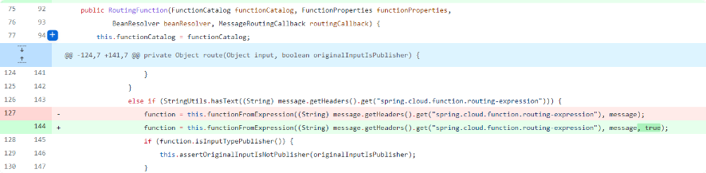
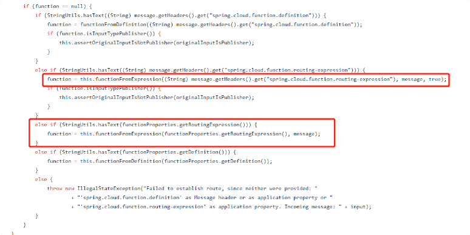

#背景
3月份的时候互联网上披露了Spring Cloud Function SPEL表达式注入漏洞，也就是Spring Cloud Function  从3.0.0.RELEASE 到3.2版本都存在一个表达式注入漏洞，这个漏洞也随后
在3.2.3版本被官方修复。既然我们无法通过Header注入，那么能否有其它办法改变spring.cloud.function.routing-expression的值从而执行代码呢？

# 代码改动
Spring Coud Function 官方在3.2.3版本修复了之前的commit为dc5128b 的SPEL注入漏洞，具体代码改动



可以看到重载了functionFromExpression方法，通过判断isViaHeader执行不同的处理过程，如果为真，就用SimpleEvaluationContext处理header 里面的输入，否则才用StandardEvaluationContext 处理。


在取Header头中的spring.cloud.function.routing-expression 是调用了functionFromExpression(StringroutingExpression, Objectinput, booleanisViaHeader)，但是从配置文件中取这个字段的时候还是调用的functionFromExpression(StringroutingExpression, Objectinput)这个方法就是造成SPEL解析命令执行漏洞的关键。



因此理论上只要能够控制functionProperties.getRoutingExpression() 的值应该也能够触发这个漏洞。
进一步看下functionProperties类中的getRoutingExpression()方法

# 控制 functionProperties#getRoutingExpression()的取值


跟进到FunctionProperties这个类，它通过@ConfigurationProperties(prefix = FunctionProperties.PREFIX) 注解绑定相应的外部配置参数的值，因此getRoutingExpression()方法就能够获取到
application.properties(yaml)中对应的”spring.cloud.function.routingExpression“的值。

因此如果更改了配置文件参数如下，则同样能够触发SPEL注入漏洞。
```jsregexp
spring.cloud.function.definition=functionRouter
spring.cloud.function.routingExpression=T(java.lang.Runtime).getRuntime().exec("calc")
```


